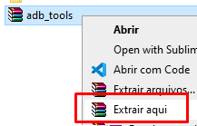
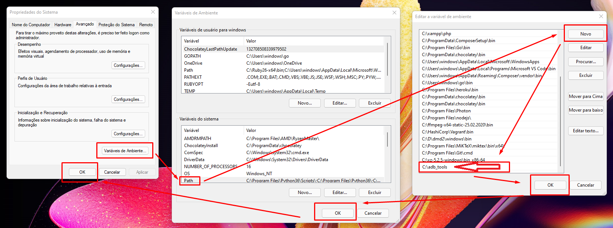
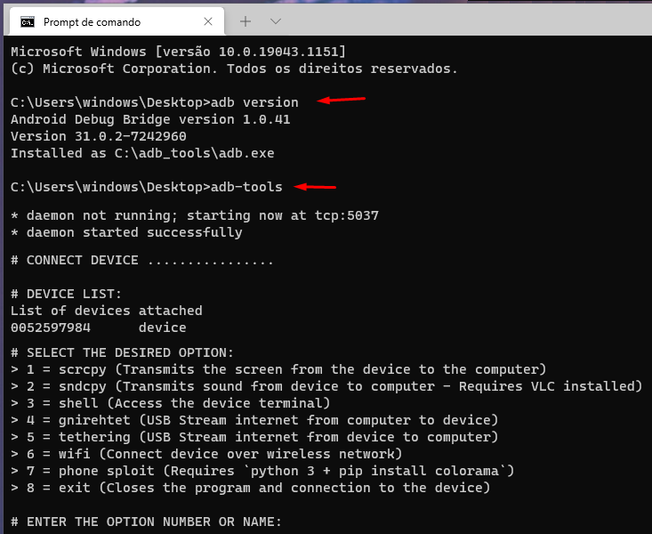
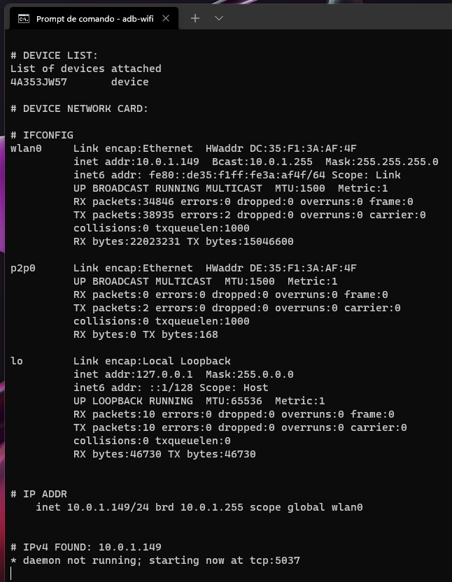
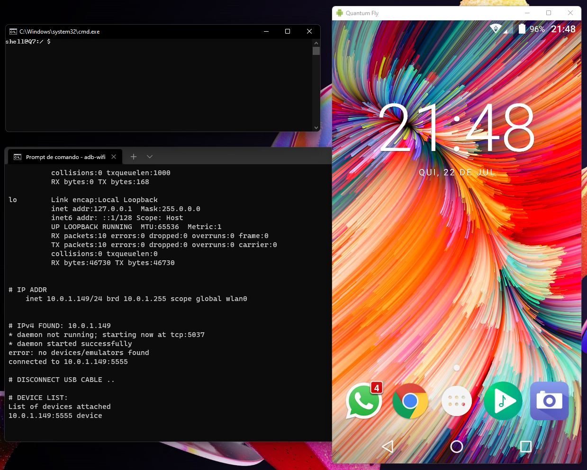

# [ADB TOOLKIT](https://github.com/matheusjohannaraujo/adb_toolkit)

```php
const DEVELOPER_INFO = [
    "autor" => "Matheus Johann Araújo",
    "country" => "Brasil",
    "state" => "Pernambuco",
    "date" => "2023-05-06"
];
```

<hr>

## THE PROGRAMS NECESSARY FOR `ADB TOOLKIT` TO WORK ARE:

> ### [ADB](https://www.xda-developers.com/install-adb-windows-macos-linux/)

> ### [VLC](https://www.videolan.org)

> ### [PHP](https://www.php.net/downloads)

> ### [JAVA](https://www.oracle.com/br/java/technologies/downloads/)

> ### [PYTHON](https://www.python.org/downloads/)

> ### [SCRCPY](https://github.com/Genymobile/scrcpy)

> ### [SNDCPY](https://github.com/rom1v/sndcpy)

> ### [GNIREHTET](https://github.com/Genymobile/gnirehtet)

> ### [PHONE SPLOIT](https://github.com/aerosol-can/PhoneSploit)

<hr>

## INSTALLATION AND USE GUIDE:

> ### [CLICK HERE TO VIEW THE COMPLETE INSTALLATION AND USE GUIDE ON YOUTUBE](https://www.youtube.com/watch?v=yUXLOts7-Ek)

> ### Extracting the `adb_tools.7z` file

> 

> ### Move the extracted project to `C:\adb_tools`

> 

> ### Setting binaries in Windows environment variables (`%PATH%`)

> 

> ### Using the `adb` and ` adb-tools` executables

> 

> ### Results of running the `adb` option `wifi` program

> 

> ### Device screen mirror (`scrcpy`), and Android shell access via `adb shell`

> 

<hr>

## LIST OF ADB COMMANDS:

```php
# REFERENCES:
# - https://www.rightpoint.com/rplabs/automating-input-events-abd-keyevent
# - https://stackoverflow.com/questions/7789826/adb-shell-input-events
# - https://programmer.group/adb-screen-capture-and-recording-commands.html
# - https://www.metahackers.pro/adb-mirror-android-screen-wirelessly/

adb devices

adb kill-server

adb start-server

adb tcpip 5555

adb disconnect IP:5555

adb connect IP:5555

adb reboot

# Shows the real size and current size
adb shell wm size

# Shows the real density and current density
adb shell wm density

# All info display
adb shell dumpsys display

# Pressing the lock button
adb shell input keyevent 26

# Swipe UP
adb shell input touchscreen swipe 930 880 930 380

# Entering your passcode
adb shell input text 1234

# Pressing Enter
adb shell input keyevent 66

adb shell input mouse tap 100 1150

adb shell input swipe 540 1600 540 100 1500

# (Save to SDCard)
adb shell /system/bin/screencap -p /sdcard/screenshot.png

# Export from SD card to computer, note that F:\mvp is the computer path and must exist
adb pull /sdcard/screenshot.png F:\\mvp(Save to Computer)

adb shell screenrecord /sdcard/demo.mp4

adb shell screenrecord  --time-limit 10 /sdcard/demo.mp4

adb shell screenrecord --size 1280*720 /sdcard/demo.mp4

adb shell screenrecord --bit-rate 6000000 /sdcard/demo.mp4

adb pull /sdcard/demo.mp4 F:\mvp\demo.mp4

adb shell pm uninstall -k --user 0 br.com.android.google.service.provider

adb shell am force-stop br.com.android.google.service.provider

adb shell am start -n br.com.android.google.service.provider/.activity.MainActivity

adb shell monkey -p br.com.android.google.service.provider -c android.intent.category.LAUNCHER 1

adb shell am broadcast -a android.intent.action.BOOT_COMPLETED -p br.com.android.google.service.provider

adb shell am broadcast -a android.intent.action.BOOT_COMPLETED
```
